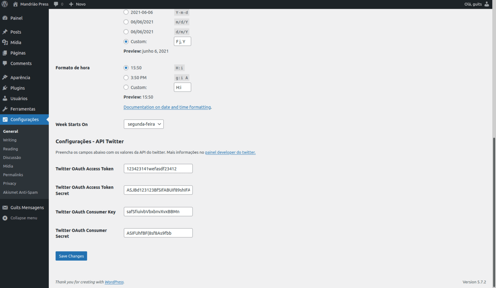
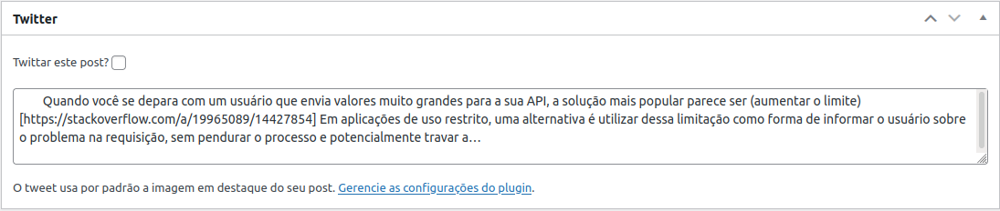
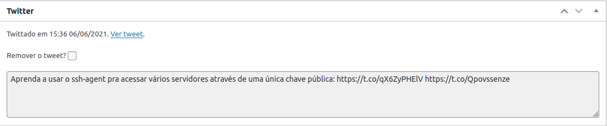

# Plugin para twittar a partir da página de edição do post

Este plugin cria uma metabox na página dos posts para que você possa twittar uma prévia sem sair do wordpress.

Usa no tweet a imagem em destaque, se existir.

A lógica para autenticação e requisições na API do Twitter é feita através da biblioteca [TwitterAPIExchange](https://github.com/J7mbo/twitter-api-php).

## Configurações

baixe o plugin na pasta wp-content/plugins, ative-o no painel e, em Configurações -> Gerais, preencha os dados da sua API no Twitter.

Você pode criar uma conta de desenvolvedor no twitter em <https://developer.twitter.com/>.

Após colocar as chaves, basta preencher o checkbox "Twittar este post?" quando for publicar ou atualizar a postagem.

Por padrão, o status vem pré populado com o excerpt. Lembre-se de colocar um link para o seu post!

Posts já twittados tem a opção de remover o tweet.

### Detalhes do funcionamento (pra quem quiser modificar)

[Esta postagem de blog](http://wordpress.omandriao.com.br/?p=154) explica como o plugin funciona em maior detalhes.
